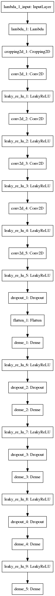
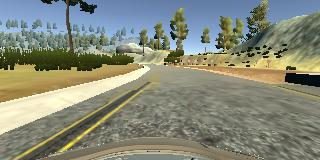
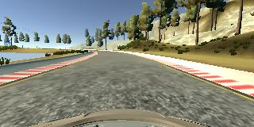
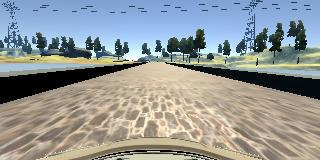
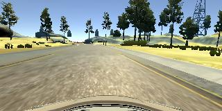

# **Behavioral Cloning** 

## Writeup Template

### You can use this file as a template for your writeup if you want to submit it as a markdown file, but feel free to use some other method and submit a pdf if you prefer.

---

**Behavioral Cloning Project**

The goals / steps of this project are the following:
* Use the simulator to collect data of good driving behavior
* Build, a convolution neural network in Keras that predicts steering angles from images
* Train and validate the model with a training and validation set
* Test that the model successfully drives around track one without leaving the road
* Summarize the results with a written report

## Rubric Points
### Here I will consider the [rubric points](https://review.udacity.com/#!/rubrics/432/view) individually and describe how I addressed each point in my implementation.  

---
### Files Submitted & Code Quality

#### 1. Submission includes all required files and can be used to run the simulator in autonomous mode

My project includes the following files:
* model.py containing the script to create and train the model
* drive.py for driving the car in autonomous mode
* model.h5 containing a trained convolution neural network 
* writeup.md or writeup_report.pdf summarizing the results

#### 2. Submission includes functional code
Using the Udacity provided simulator and my drive.py file, the car can be driven autonomously around the track by executing 
```sh
python drive.py model.h5
```

#### 3. Submission code is usable and readable

The model.py file contains the code for training and saving the convolution neural network. The file shows the pipeline I used for training and validating the model. 

### Model Architecture and Training Strategy

#### 1. An appropriate model architecture has been employed

I refered to use CNN described in [Nvidia's paper]( http://images.nvidia.com/content/tegra/automotive/images/2016/solutions/pdf/end-to-end-dl-using-px.pdf)

The network consists of preprocessing by lambda layer, 5 Convolutional2D and three fully connected layer with droupout. 

I inserted LeakyReLU as activation function. 

Following is the output of `model.summary()`

```
_________________________________________________________________
Layer (type)                 Output Shape              Param #   
=================================================================
lambda_1 (Lambda)            (None, 160, 320, 3)       0         
_________________________________________________________________
cropping2d_1 (Cropping2D)    (None, 90, 320, 3)        0         
_________________________________________________________________
conv2d_1 (Conv2D)            (None, 43, 158, 24)       1824      
_________________________________________________________________
leaky_re_lu_1 (LeakyReLU)    (None, 43, 158, 24)       0         
_________________________________________________________________
conv2d_2 (Conv2D)            (None, 20, 77, 36)        21636     
_________________________________________________________________
leaky_re_lu_2 (LeakyReLU)    (None, 20, 77, 36)        0         
_________________________________________________________________
conv2d_3 (Conv2D)            (None, 8, 37, 48)         43248     
_________________________________________________________________
leaky_re_lu_3 (LeakyReLU)    (None, 8, 37, 48)         0         
_________________________________________________________________
conv2d_4 (Conv2D)            (None, 6, 35, 64)         27712     
_________________________________________________________________
leaky_re_lu_4 (LeakyReLU)    (None, 6, 35, 64)         0         
_________________________________________________________________
conv2d_5 (Conv2D)            (None, 4, 33, 64)         36928     
_________________________________________________________________
leaky_re_lu_5 (LeakyReLU)    (None, 4, 33, 64)         0         
_________________________________________________________________
dropout_1 (Dropout)          (None, 4, 33, 64)         0         
_________________________________________________________________
flatten_1 (Flatten)          (None, 8448)              0         
_________________________________________________________________
dense_1 (Dense)              (None, 960)               8111040   
_________________________________________________________________
leaky_re_lu_6 (LeakyReLU)    (None, 960)               0         
_________________________________________________________________
dropout_2 (Dropout)          (None, 960)               0         
_________________________________________________________________
dense_2 (Dense)              (None, 100)               96100     
_________________________________________________________________
leaky_re_lu_7 (LeakyReLU)    (None, 100)               0         
_________________________________________________________________
dropout_3 (Dropout)          (None, 100)               0         
_________________________________________________________________
dense_3 (Dense)              (None, 50)                5050      
_________________________________________________________________
leaky_re_lu_8 (LeakyReLU)    (None, 50)                0         
_________________________________________________________________
dropout_4 (Dropout)          (None, 50)                0         
_________________________________________________________________
dense_4 (Dense)              (None, 10)                510       
_________________________________________________________________
leaky_re_lu_9 (LeakyReLU)    (None, 10)                0         
_________________________________________________________________
dense_5 (Dense)              (None, 1)                 11        
=================================================================
Total params: 8,344,059
Trainable params: 8,344,059
Non-trainable params: 0
```

- Images output by `plot_model` is as following. 




#### 2. Attempts to reduce overfitting in the model

I adopted dropout after `Flatten`, and `Dense` for thrree times. 

I discarded 90% of samples with angle = 0.0 since it occupy the large amount of dataset. 

#### 3. Model parameter tuning

The model used an adam optimizer, so the learning rate was not tuned manually. 

#### 4. Appropriate training data
#### Kind of data I used

I use center, left and right angle of images. For adjusting, I add and subtract -0.2 from the right and left image, respectively. 

For making sample I made two kind of data. The first one is run regurally. 

- `run normaly`: In this case, the car run counter-clockwise. It has 12464 samples is prepared.

The second one is to learn difficult part of the course. 

- `left to center`: Those samples are intended to recovery back from edge of the road. It has 6135 samples. Following is an example. 



- `curve for the first difficult corner`: Those samples are intended to learn how to curve the first difficult corner. It has 1242 samples. 



- `bridge`: Those samples are used to turn the second difficult curve after the bridve. 1638 samples. 



- `curve for after the bridge`: Those examples are used to the second and  I prepared 4740 samples. 



I also applied flipping left and right for those data. 

##### Data processing

I applied normalization and cropping as follows. 

```
model.add(Lambda(lambda x: (x/255.0) - 0.5, input_shape=(160, 320, 3)))
model.add(Cropping2D(cropping=( (50, 20), (0, 0) )))
```

I finally randomly shuffled the data set and put 20% of the data into a validation set. 

### Result 
Following links shows the result. 

